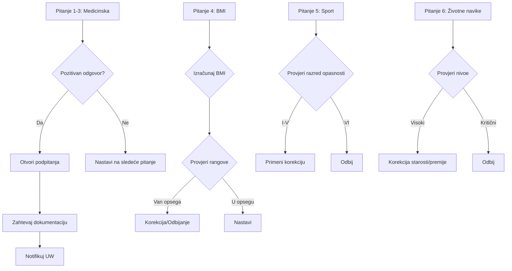

# VELIKI UPITNIK (Great Questionnaire)

## Osnovne Informacije

**Tip Upitnika**: Veliki upitnik za zdravstveno stanje  
**QuestionnaireTypeID**: Potrebno mapirati na postojeći ili kreirati novi  
**Uslovi Prikazivanja**: Prema UW pravilima i visini osigurane sume (SumAtRisk)

## Struktura Pitanja

### Pitanje 1-3: Medicinska Pitanja

Pitanja od 1 do 3 se dele na medicinska pitanja i pitanja u vezi sa ostalim rizicima.

**Logika**: 
- Ukoliko su odgovori na sva pitanja negativni → odobrava se prijem u osiguranje
- Ukoliko je na neko od pitanja odgovoreno pozitivno → otvaraju se nova podpitanja
- Omogućiti izbor više od jedne opcije
- Prikazati SVE poruke koje su vezane za svaku izabranu opciju

#### Pitanje 1.2: Bolesti srca i krvnih sudova

**QuestionID**: TBD  
**QuestionText**: "Bolesti srca i krvnih sudova"  
**QuestionOrder**: 1.2  
**QuestionFormatID**: Multiple Choice with sub-questions  
**Required**: Da

**Predefinisani  odgovori (opcije)**:
| PredefinedAnswerID | Answer | Code | PreSelected | StatisticalWeight | SubQuestions |
|-------------------|---------|------|-------------|-------------------|--------------|
| TBD | Povišen krvni pritisak | BP_HIGH | Ne | NULL | Da |
| TBD | Bolesti srčanih zalistaka | HEART_VALVE | Ne | NULL | Da |
| TBD | Koronarna bolest | CORONARY | Ne | NULL | Da |
| TBD | Srčana aritmija | ARRHYTHMIA | Ne | NULL | Da |

**Logika Grananja (Branching)**:
```
IF (Izabrana opcija "Povišen krvni pritisak") THEN
    - Otvori podpitanje: Detalji o lečenju
    - Prikaži poruku agentu: "Potrebna medicinska dokumentacija"
    - Prikaži poruku UW: "Provera potrebna"
    - Zahtevana dokumentacija: [Lista iz Veliki upitnik-poruke.docx]
END IF
```

### Pitanje 4: Podaci o Visini i Težini (BMI Kalkulacija)

**QuestionID**: TBD  
**QuestionText**: "Unesite vašu visinu i težinu"  
**QuestionOrder**: 4  
**QuestionFormatID**: Computed (BMI)  
**ReadOnly**: Ne

**Kalkulacija**:
```
BMI = Težina (kg) / (Visina (m))²
```

**Logika Izračunavanja**:
```
BMI = Težina (kg) / (Visina (m))²
Output: BMI_VALUE (float)
```

**Validacija**:
- Range check: Visina (50-250), Težina (20-300)
- Cross-validation: Upozorenje za ekstremne vrednosti

**Izlaz za UW (Output)**:
- `BMI_Value`: 28.5

*Napomena: Klasifikaciju u rizičnu grupu (npr. 'OVERWEIGHT') i korekcije premije vrši UW modul na osnovu BMI vrednosti.*

### Pitanje 5: Sport

**QuestionID**: TBD  
**QuestionText**: "Sport koji praktikujete"  
**QuestionOrder**: 5  
**QuestionFormatID**: Autocomplete Dropdown  
**ReferenceTableID**: Sports (lookup table)

**Funkcionalnost**:
- Unos prva 3 slova aktivira autocomplete
- Prikazuju se samo nazivi sportova agentu

**Izlaz za UW (Output)**:
- `SportID`: ID izabranog sporta

*Napomena: UW modul na osnovu SportID preuzima DangerClass i određuje korekciju premije.*

### Pitanje 6: Konzumiranje Alkohola, Droge i Duvana

**QuestionID**: TBD (composite question)  
**QuestionText**: "Dnevna konzumacija alkohola, droge i cigareta/duvana"  
**QuestionOrder**: 6  
**QuestionFormatID**: Composite (multiple sub-questions)


#### Sub-pitanje 6a: Alkohol

**Tip**: Radio Buttons (Single Choice)  
**Opcije**:
- `ALCOHOL_LEVEL_0` (do 1 lit. piva...)
- `ALCOHOL_LEVEL_1` (do 1.5 lit. piva...)
- `ALCOHOL_LEVEL_2` (do 2 lit. piva...)
- `ALCOHOL_LEVEL_3_REJECT` (preko 2 lit. piva...)

**Izlaz za UW**: Marker `RISK_LIFESTYLE_ALCOHOL` sa vrednošću nivoa.

#### Sub-pitanje 6b: Duvan/Cigarete

**Tip**: Radio Buttons (Single Choice)  
**Opcije**:
- `TOBACCO_LEVEL_0` (manje od 20...)
- `TOBACCO_LEVEL_1` (do 30...)
- `TOBACCO_LEVEL_2` (do 40...)
- `TOBACCO_LEVEL_3_REJECT` (preko 40...)

**Izlaz za UW**: Marker `RISK_LIFESTYLE_TOBACCO` sa vrednošću nivoa.

#### Sub-pitanje 6c: Droge/Narkotici

**Tip**: Boolean (Da/Ne)  
**Logika (UI)**:
- Prikazati upozorenje korisniku: "Zbog konzumiranja droga moguće je odbijanje iz osiguranja"

**Napomena za UW**:
- Ako je odgovor "Da" -> Status ponude: Odbijeno

### Pitanje 8: BMI Index

(Videti Pitanje 4 - ista logika i kalkulacija)

## Međuzavisnosti Pitanja

### Branching Logic



## Potrebne Reference Tabele

### Sports Table

**Tabela**: `Sports` (ili sličan naziv)  
**Kolone**:
- SportID (PK)
- SportName (string)
- DangerClassID (FK → DangerClass)
- LifeIncrease_Permille (decimal)
- MAK_Increase_Permille (decimal)
- Accident_Increase_Percent (decimal)

### DangerClass Table

**Tabela**: `DangerClass`  
**Kolone**:
- DangerClassID (PK)
- ClassName (I, II, III, IV, V, VI)
- Description (string)

## Dokumentacija koja se Zahteva

Prema odgovorima na pitanja, sistem automatski generiše zahtev za sledećom dokumentacijom:
- Medicinska dokumentacija (na osnovu pozitivnih odgovora)
- Lekarski izveštaji
- Laboratorijski nalazi
- Saglasnost za isključenje (za visok rizik zanim anja/sporta)

## Integracija sa Bazom

### Mapiranje na QuestionnaireTypes

```sql
INSERT INTO QuestionnaireTypes (QuestionnaireTypeID, Name, Description, Code)
VALUES 
(TBD, 'Veliki upitnik', 'Detaljan zdravstveni upitnik za veće osigurane sume', 'GREAT_QUEST');
```

### Mapiranje Pitanja

```sql
-- Primer za BMI pitanje
INSERT INTO Questions (QuestionID, QuestionText, QuestionOrder, QuestionFormatID, SpecificQuestionTypeID)
VALUES 
(TBD, 'Unesite vašu visinu i težinu', 4, (SELECT QuestionFormatID FROM QuestionFormats WHERE Name = 'Computed'), TBD);

-- Insert BMI calculation logic
INSERT INTO ComputedQuestions (QuestionID, ComputeMethodID, OutputModeID)
VALUES 
(TBD, (SELECT ComputeMethodID FROM ComputeMethods WHERE Code = 'BMI_CALC'), TBD);
```

## Gap Analiza - Nedostajuće Komponente

### U Modelu Baze (Questionnaire Domain)

1. ✅ **Questions** - Postoji
2. ✅ **PredefinedAnswers** - Postoji
3. ✅ **PredefinedAnswerSubQuestions** - Postoji
4. ✅ **ComputedQuestions** - Postoji (za BMI i Scoring)
5. ✅ **Sports** - Postoji (Lookup)

*Napomena: Tabele kao što su `CorrectionRules`, `DocumentRequirements` i `NotificationTemplates` su identifikovane kao deo **UW Modula** i nisu predmet ovog dokumenta.*

## Statistički Uticaj na Rezultat

Svaki odgovor može uticati na:
1. **Premiju** - procentualno ili apsolutno povećanje
2. **Pristupnu starost** - uvećanje starosti za kalkulaciju
3. **Osiguranu sumu** - ograničenje ili smanjenje
4. **Status ponude** - Odobreno / Korekcija / Odbijeno / Odloženo

---

## Referencirana Dokumentacija

Kompletni podaci se nalaze u sledećim fajlovima (dostupni u `docs/specification/Upitnici i obrasci`):
1. **Pitanja i Logika**: `veliki_upitnik_tabela.xlsx`
2. **Validacione Poruke**: `veliki_upitnik_poruke.docx`
3. **Sportska Lista**: `Sports.xlsx`

---

*Status: Finalized - Logika validirana, punjenje podataka se vrši iz referenciranih fajlova*
