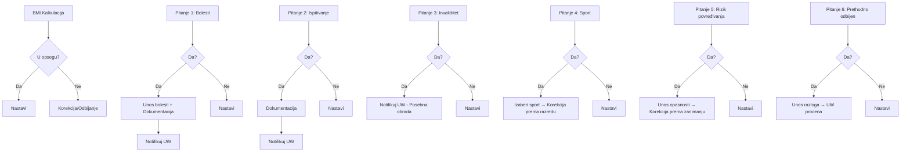

# SKRAĆENI UPITNIK (Short Questionnaire)

## Osnovne Informacije

**Tip Upitnika**: Skraćeni upitnik za zdravstveno stanje  
**QuestionnaireTypeID**: Potrebno mapirati na postojeći ili kreirati novi  
**Uslovi Prikazivanja**: Prema UW pravilima - za srednje osigurane sume

## Struktura Pitanja

### BMI Pitanje (Isto kao u Velikom Upitniku)

**QuestionID**: TBD (možda isti kao u Velikom upitniku)  
**QuestionText**: "Omogućiti unos visine i težine i automatsko izračunavanje BMI indeksa"  
**QuestionOrder**: 0  
**QuestionFormatID**: Computed (BMI)  
**ReadOnly**: Ne

**Kalkulacija**:
```
BMI = težina / visina²
```

**Validacija**: Ista kao u Velikom upitniku (vidi dokument 01_VELIKI_UPITNIK.md)

**Napomena za UW**:
- Ako BMI ukazuje na rizik -> Moguća korekcija ili odbijanje (UW Decision)

### Zdravstveni Karton

**QuestionID**: TBD  
**QuestionText**: "Unesite naziv zdravstvene ustanove kod koje klijent ima otvoren zdravstveni karton"  
**QuestionOrder**: 0.5  
**QuestionFormatID**: String (free text)  
**Required**: Da

**Tip podatka**: String  
**Validacija**: Obavezan unos  
**Poruke**: Nema specifičnih poruka

---

### Pitanje 1: Bolesti i Sumnje

**QuestionID**: TBD  
**QuestionText**: "Da li ste ikada bolovali ili sada bolujete te da li vam je postavljena sumnja i da li ste ispitivani za postojanje sledećih bolesti:

- malignih tumora, premalignih promena, polipa bilo koje lokalizacije
- visokog krvnog pritiska
- urođenih ili stečenih srčanih mana i slabosti
- poremećaja srčanog ritma, kardiomiopatije, infarkta srca, angine pektoris
- aneurizme arterija, ugrađeni stentovi, operacije na srcu i mozgu
- proširenih vena i tromboze
- leukemija, limfoma, HIV, SIDA
- sistemskog lupusa, sistemskih bolesti vezivnog tkiva, gihta
- poremećaja zgrušavanja krvi
- hronične bolesti pluća, plućne embolije
- Kronove bolesti, ulceroznog kolitisa
- bolesti štitaste, nadbubrežne žlezde i hipofize
- bolesti bubrega i bešike
- bolesti materice, bolesti jajnika, bolesti dojke
- bilo kog oblika: hepatitisa, ciroze jetre, bolesti žuči i žučnih puteva
- bolesti pankreasa
- epilepsije, moždanog udara, psihoze, pareze, paralize
- bolesti motornog neurona, demijelinizirajućih bolesti
- naslednih ili stečenih mišićnih distrofija
- dijabetesa"

**QuestionOrder**: 1  
**QuestionFormatID**: Boolean (Da/Ne)  
**Required**: Da

**Predefinisani Odgovori**:
| PredefinedAnswerID | Answer | Code | PreSelected | SubQuestionID | StatisticalWeight |
|-------------------|---------|------|-------------|---------------|-------------------|
| TBD | Da | YES | Ne | TBD | NULL |
| TBD | Ne | NO | Ne | NULL | NULL |

**Logika Grananja**:
```
**Logika (UI)**:
- Ako je odgovor "Da" -> Prikazati polje za unos "Koje oboljenje"

**Napomena za UW**:
- Zahtevati dokumentaciju
- Kreirati notifikaciju
```

**Poruka**:  
"Ukoliko je označen pozitivan odgovor – napisati koje oboljenje i priložiti kompletnu medicinsku dokumentaciju"

---

### Pitanje 2: Ispitivanje ili Praćenje

**QuestionID**: TBD  
**QuestionText**: "Da li se trenutno nalazite na ispitivanju ili praćenju nekog zdravstvenog stanja ili čekate rezultate dijagnostičkih procedura?"  
**QuestionOrder**: 2  
**QuestionFormatID**: Boolean (Da/Ne)  
**Required**: Da

**Predefinisani Odgovori**:
| PredefinedAnswerID | Answer | Code | PreSelected | SubQuestionID | StatisticalWeight |
|-------------------|---------|------|-------------|---------------|-------------------|
| TBD | Da | YES | Ne | TBD | NULL |
| TBD | Ne | NO | Ne | NULL | NULL |

**Logika Grananja**:
```
**Napomena za UW**:
- Zahtevati dokumentaciju
- Kreirati notifikaciju
```

**Poruka**:  
"Ukoliko je označen pozitivan odgovor – priložiti kompletnu medicinsku dokumentaciju"

---

### Pitanje 3: Invaliditet/Nesposobnost

**QuestionID**: TBD  
**QuestionText**: "Da li Vam je utvrđena trajna nesposobnost za rad, nesposobnost za samostalan život ili određeni stepen invaliditeta?"  
**QuestionOrder**: 3  
**QuestionFormatID**: Boolean (Da/Ne)  
**Required**: Da

**Predefinisani Odgovori**:
| PredefinedAnswerID | Answer | Code | PreSelected | StatisticalWeight |
|-------------------|---------|------|-------------|-------------------|
| TBD | Da | YES | Ne | NULL |
| TBD | Ne | NO | Ne | NULL |

**Logika Grananja**:
```
**Napomena za UW**:
- Posebna obrada (Referral)
- Kreirati notifikaciju
```

**Poruka**: Nema specifične poruke prema specifikaciji

---

### Pitanje 4: Sport

**QuestionID**: TBD (možda isti kao u Velikom upitniku)  
**QuestionText**: "Da li se bavite nekim sportom organizovano ili rekreativno"  
**QuestionOrder**: 4  
**QuestionFormatID**: Boolean sa podpitanjem  
**Required**: Da

**Predefinisani Odgovori**:
| PredefinedAnswerID | Answer | Code | PreSelected | SubQuestionID | StatisticalWeight |
|-------------------|---------|------|-------------|---------------|-------------------|
| TBD | Da | YES | Ne | TBD (Sport lookup) | NULL |
| TBD | Ne | NO | Ne | NULL | NULL |

**Logika Grananja**:
```
**Logika (UI)**:
- Ako je odgovor "Da" -> Otvori dropdown sa sportovima (autocomplete)

**Napomena za UW**:
- Odrediti razred opasnosti na osnovu SportID
- Primeniti korekciju
```

**Poruka**: Iste poruke kao u Velikom upitniku za sport

---

### Pitanje 5: Povećan Rizik od Povređivanja

**QuestionID**: TBD (možda povezano sa Zanimanjem iz Velikog upitnika)  
**QuestionText**: "Da li ste na poslu ili u slobodno vreme izloženi povećanom riziku od povređivanja? (zračenje, rad sa eksplozivom, materijama štetnim po zdravlje, rad na visini ili pod vodom)"  
**QuestionOrder**: 5  
**QuestionFormatID**: Boolean sa podpitanjem  
**Required**: Da

**Predefinisani Odgovori**:
| PredefinedAnswerID | Answer | Code | PreSelected | SubQuestionID | StatisticalWeight |
|-------------------|---------|------|-------------|---------------|-------------------|
| TBD | Da | YES | Ne | TBD (Opis opasnosti) | NULL |
| TBD | Ne | NO | Ne | NULL | NULL |

**Logika Grananja**:
```
**Logika (UI)**:
- Ako je odgovor "Da" -> Prikazati polje za unos "Navesti opasnosti"

**Napomena za UW**:
- Primeniti korekciju prema opisu opasnosti/zanimanju
```

**Poruka**:  
"Ukoliko je odgovor pozitivan navesti opasnosti"

---

### Pitanje 6: Prethodno Odbijen ili Prihvaćen pod Uslovima

**QuestionID**: TBD  
**QuestionText**: "Da li vam je, do sada, neki drugi osiguravač, odbio ponudu o životnom osiguranju ili je prihvatio pod posebnim uslovima?"  
**QuestionOrder**: 6  
**QuestionFormatID**: Boolean sa podpitanjem  
**Required**: Da

**Predefinisani Odgovori**:
| PredefinedAnswerID | Answer | Code | PreSelected | SubQuestionID | StatisticalWeight |
|-------------------|---------|------|-------------|---------------|-------------------|
| TBD | Da | YES | Ne | TBD | NULL |
| TBD | Ne | NO | Ne | NULL | NULL |

**Logika Grananja**:
```
**Logika (UI)**:
- Ako je odgovor "Da" -> Prikazati polje za unos "Razlozi..."

**Napomena za UW**:
- Dodatna procena (Referral)
```

**Poruka**:  
"Ukoliko je odgovor pozitivan navesti razloge zbog kojih je ponuda odbijena ili prihvaćena pod posebnim uslovima"

---

## Predefinisani Tekst za Štampani Oblik

Pored pitanja, na štampanom obliku Upitnika ispisuje se predefinisani tekst iz dokumenta **"Pitanja za osiguranika – SKR"**.

**Napomena**: Potrebno pribav iti ovaj dokument za kompletnu specifikaciju.

## Međuzavisnosti Pitanja



## Dokumentacija koja se Zahteva

| Pitanje | Uslov | Dokumentacija |
|---------|-------|---------------|
| Pitanje 1 | Answer = "Da" | Kompletna medicinska dokumentacija za navedeno oboljenje |
| Pitanje 2 | Answer = "Da" | Kompletna medicinska dokumentacija o ispitivanju/dijagnostici |
| Pitanje 4 | Answer = "Da" + Visok rizik sport | Opcionalno: Saglasnost za isključenje (ako razred VI) |
| Pitanje 5 | Answer = "Da" + Visok rizik zanimanje | Opcionalno: Saglasnost za isključenje |

## Integracija sa Bazom

### Mapiranje na QuestionnaireTypes

```sql
INSERT INTO QuestionnaireTypes (QuestionnaireTypeID, Name, Description, Code)
VALUES 
(TBD, 'Skraćeni upitnik', 'Skraćeni zdravstveni upitnik za srednje osigurane sume', 'SHORT_QUEST');
```

### Mapiranje Pitanja

```sql
-- Primer za Pitanje 1
INSERT INTO Questions (QuestionID, QuestionText, QuestionOrder, QuestionFormatID, SpecificQuestionTypeID)
VALUES 
(TBD, 'Da li ste ikada bolovali ili sada bolujete...', 1, (SELECT QuestionFormatID FROM QuestionFormats WHERE Name = 'Boolean'), TBD);

-- Predefinisani odgovori
INSERT INTO PredefinedAnswers (PredefinedAnswerID, QuestionID, PreSelected, Answer, Code)
VALUES 
(TBD, TBD, 0, 'Da', 'YES'),
(TBD, TBD, 0, 'Ne', 'NO');

-- Sub-question za detalje o bolesti
INSERT INTO PredefinedAnswerSubQuestions (PredefinedAnswerSubQuestionID, PredefinedAnswerID, SubQuestionID)
VALUES 
(TBD, (SELECT PredefinedAnswerID WHERE Code = 'YES'), TBD);
```

## Gap Analiza - Nedostajuće Komponente

### U Modelu Baze (Questionnaire Domain)

1. ✅ **Questions** - Postoji
2. ✅ **PredefinedAnswers** - Postoji
3. ✅ **PredefinedAnswerSubQuestions** - Postoji
4. ✅ **ComputedQuestions** - Postoji (za BMI)
5. ✅ **Sports / DangerClass** - Već definisano u Velikom upitniku

*Napomena: `RequiredDocumentation` i `NotificationRules` pripadaju **UW Modulu**.*

### Razlike u odnosu na Veliki Upitnik

| Aspekt | Veliki Upitnik | Skraćeni Upitnik |
|--------|---------------|------------------|
| Broj pitanja | 8+ (detaljno) | 6 (+ BMI) |
| Detaljnost medicinskih pitanja | Visoka - po sistemima | Agregovano - jedno pitanje |
| Sport | Obavezan unos naziva sporta | Boolean sa opcionalnim unosom |
| Zanimanje | Detaljno (Tab Partneri) | Samo povećan rizik povređivanja |
| Validacija | Kompleksna - grananje | Jednostavnija - uglavnom boolean |

## Statistički Uticaj na Rezultat

Svaki pozitivan odgovor šalje ponudu na UW pregled. Finalan uticaj na:
1. **Status ponude** - "Poslato Underwriteru"
2. **Zahtevana dokumentacija** - Lista dokumenata
3. **Korekcije** - Prema povezanim pravilima (BMI, Sport, Zanimanje)
4. **UW odluka** - Odobreno / Korekcija / Odloženo / Odbijeno

---

## Referencirana Dokumentacija

Kompletni podaci se nalaze u sledećim fajlovima (dostupni u `docs/specification/Upitnici i obrasci`):
1. **Logika i Pitanja**: `skraceni_upitnik .xlsx`
2. **Tekst Pitanja**: `skraceni_upitnik .docx`

---

*Status: Finalized - Logika validirana, punjenje podataka se vrši iz referenciranih fajlova*
