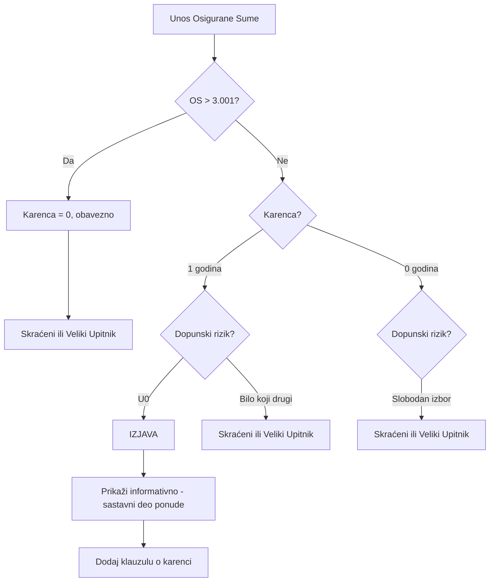

# IZJAVA (Declaration)

## Osnovne Informacije

**Tip Upitnika**: Izjava o zdravstvenom stanju  
**QuestionnaireTypeID**: Potrebno mapirati na postojeći ili kreirati novi  
**Uslovi Prikazivanja**: Prema UW pravilima - za niske osigurane sume sa karencom ili bez dopunskih rizika

## Pravila Ugovaranja

### Uslovi za Prikazivanje Izjave

Prema specifikaciji na stranici Tab Upitnik - deo III: "Pravila ugovaranja dopunskih rizika":

| Osigurana Suma | Karenca | Dopunski Rizik | Rezultat |
|----------------|---------|----------------|----------|
| OS > 3.001,00 | Defaultno 0 (bez mogućnosti izmene) | - | **IZJAVA se NE prikazuje** |
| OS < 3.000,00 | 1 godina | U0 (bez dopunskih rizika) | **IZJAVA** |
| OS < 3.000,00 | 0 godina | Slobodan izbor | **Zavisi od izbora dopunskog rizika** (Skraćeni ili Veliki upitnik) |

**Napomena za jednogodišnje ugovore**:
- Za jednogodišnje ugovore nije primenljiva karenca od 1 godine (važi samo za IK)

### Klauzula za Karencu

Kada je izabrana karenca od 1 godina:

**Poruka za klijenta**:
> "Izborom karence od 1 godine, za slučaj smrti usled bolesti, Ugovarač nema obavezu popunjavanja Upitnika o zdravstvenom stanju/Izjave. U ovom slučaju Osiguravač nema obavezu da vrati uplaćenu premiju"

**Pravna klauzula**:
> Potrebno je na ponudi i na predugovornim informacijama ubaciti klauzulu za isključenje obaveze osiguravača za slučaj smrti u prvoj godini osiguranja.

## Struktura "Pitanja" (Informativni Prikaz)

Izjava se **NE** prikazuje kao upitnik sa pitanjima již odgovorima. 

**Prikaz na ekranu aplikacije**:
- Samo informativni karakter za Agenta
- Tekst izjave se prikazuje
- Agent ne unosi podatke
- Izjava je **sastavni deo Ponude** (ne štampa se posebno)

**Obaveštenje za korisnika na ekranu**:
> "Na osnovu unetih parametara dovoljno je potpisivanje Izjave o zdravstvenom stanju."

## Sadržaj Izjave

**Napomena**: Potpuni tekst Izjave nije naveden u dostavljenoj specifikaciji. Prema uobičajenoj praksi, Izjava sadrži:

1. **Osnovne informacije o osiguraniku** (ime, prezime, datum rođenja, JMBG)
2. **Izjava o zdravstvenom stanju**:
   - "Izjavljujem da sam u dobrom zdravstvenom stanju"
   - "Nisam bio/la na lečenju u poslednjih X meseci"
   - "Nemam hronične bolesti"
   - Slično...
3. **Potpis osiguranika**
4. **Datum potpisa**

### QuestionnaireType Karakteristike

```sql
INSERT INTO QuestionnaireTypes (QuestionnaireTypeID, Name, Description, Code)
VALUES 
(TBD, 'Izjava', 'Izjava o zdravstvenom stanju - bez detaljnih pitanja', 'DECLARATION');
```

**Karakteristike**:
- **HasQuestions**: False (ili Questions = 0)
- **RequiresSignature**: True
- **IsPrintedWithApplication**: True
- **IsInfoOnly**: True (samo informativno za agenta)

## Logika Prikazivanja



## Validacija i Provera

### Nema Automatskih Validacija

Za Izjavu **NEMA**:
- Automatskih validacija
- Proveravanja odgovora
- Grananja (branching)
- Sub-pitanja
- Korekcija prema odgovorima

### Jedina Provera

**Potpis**: Provera da li je Izjava potpisana (digitalno ili fizički - nakon upload-a skeniranog dokumenta)

## Integracija sa Ostalim Procesima

### Tab Štampa

- Izjava se **automatski** uključuje u štampanu ponudu
- Ne štampa se posebno
- Prikazuje se zajedno sa ponudom

### Upload Dokumentacije

Agent uploaduje **potpisanu Izjavu** zajedno sa ostalim dokumentima ponude.

### Prenos u DMS

Potpisana Izjava se prenosi u DMS kao deo kompletne dokumentacije ponude.

## Međuzavisnosti

### Veza sa Karencom

```sql
-- Pravilo: Ako je Karenca = 1 I DopunskiRizik = U0 THEN Upitnik = Izjava

SELECT 
    q.QuestionnaireTypeID,
    q.Name AS QuestionnaireName
FROM 
    QuestionnaireTypes q
WHERE 
    -- Logika koja se primenjuje tokom kreiranja ponude
    (@Karenca = 1 AND @DopunskiRizik = 'U0' AND @OsiguranaSum a < 3000)
    THEN q.Code = 'DECLARATION'
```

### Veza sa Proizvodom

Izjava se može primeniti na **sve proizvode** osim:
- **IK** (jednogodišnji ugovori - karenca nije primenljiva)

## Gap Analiza - Nedostajuće Komponente

### U Modelu Baze

1. ✅ **QuestionnaireTypes** - Postoji, potrebno dodati tip "IZJAVA"
2. ⚠️ **DeclarationTemplates** - Potrebno dodati tabelu za skladištenje template-a Izjave (tekst)
3. ⚠️ **QuestionnaireDisplayRules** - Potrebno dodati pravila za prikazivanje upitnika prema OS, Karenci, Dopunskim rizicima
4. ⚠️ **CarencyClauses** - Potrebno dodati klauzule za karencu koje se dodaju na ponudu/predugovorne informacije
5. ✅ **DocumentUploads** - Verovatno postoji, za upload potpisane izjave

### Predložene Nove Tabele

#### 1. DeclarationTemplates

```sql
CREATE TABLE DeclarationTemplates (
    DeclarationTemplateID INT PRIMARY KEY IDENTITY(1,1),
    TemplateName NVARCHAR(200) NOT NULL,
    TemplateText NVARCHAR(MAX) NOT NULL,
    ProductTypeID INT NULL, -- NULL = za sve proizvode
    IsActive BIT NOT NULL DEFAULT 1,
    CreatedDate DATETIME NOT NULL DEFAULT GETDATE(),
    ModifiedDate DATETIME NULL,
    CONSTRAINT FK_DeclarationTemplates_ProductTypes 
        FOREIGN KEY (ProductTypeID) REFERENCES ProductTypes(ProductTypeID)
);
```

#### 2. QuestionnaireDisplayRules

```sql
CREATE TABLE QuestionnaireDisplayRules (
    DisplayRuleID INT PRIMARY KEY IDENTITY(1,1),
    ProductTypeID INT NULL, -- NULL = za sve proizvode
    SumInsuredFrom DECIMAL(18,2) NULL,
    SumInsuredTo DECIMAL(18,2) NULL,
    CarencyYears INT NULL,
    AdditionalRiskCode NVARCHAR(50) NULL,
    QuestionnaireTypeID SMALLINT NOT NULL,
    Priority INT NOT NULL, -- Za slučaj da više pravila odgovara
    IsActive BIT NOT NULL DEFAULT 1,
    CONSTRAINT FK_QuestionnaireDisplayRules_QuestionnaireTypes
        FOREIGN KEY (QuestionnaireTypeID) REFERENCES QuestionnaireTypes(QuestionnaireTypeID),
    CONSTRAINT FK_QuestionnaireDisplayRules_ProductTypes
        FOREIGN KEY (ProductTypeID) REFERENCES ProductTypes(ProductTypeID)
);
```

**Primer podataka**:
```sql
-- Pravilo za Izjavu
INSERT INTO QuestionnaireDisplayRules
(ProductTypeID, SumInsuredFrom, SumInsuredTo, CarencyYears, AdditionalRiskCode, QuestionnaireTypeID, Priority)
VALUES
(NULL, 0, 3000, 1, 'U0', (SELECT QuestionnaireTypeID FROM QuestionnaireTypes WHERE Code = 'DECLARATION'), 1);

-- Pravilo za Veliki upitnik
INSERT INTO QuestionnaireDisplayRules
(ProductTypeID, SumInsuredFrom, SumInsuredTo, CarencyYears, AdditionalRiskCode, QuestionnaireTypeID, Priority)
VALUES
(NULL, 3001, 999999999, 0, NULL, (SELECT QuestionnaireTypeID FROM QuestionnaireTypes WHERE Code ='GREAT_QUEST'), 2);
```

#### 3. CarencyClauses

```sql
CREATE TABLE CarencyClauses (
    CarencyClauseID INT PRIMARY KEY IDENTITY(1,1),
    ClauseName NVARCHAR(200) NOT NULL,
    ClauseText NVARCHAR(MAX) NOT NULL,
    CarencyYears INT NOT NULL,
    AppliesTo NVARCHAR(50) NOT NULL, -- 'OFFER', 'CONTRACT', 'PRECONTRACTUAL_INFO'
    IsActive BIT NOT NULL DEFAULT 1,
    CreatedDate DATETIME NOT NULL DEFAULT GETDATE()
);
```

**Primer podataka**:
```sql
INSERT INTO CarencyClauses (ClauseName, ClauseText, CarencyYears, AppliesTo)
VALUES 
('Klauzula o karenci 1 godina', 
 'Za slučaj smrti usled bolesti u prvoj godini osiguranja, Osiguravač nema obavezu isplate osigurane sume niti povrata uplaćene premije.',
 1,
 'OFFER');

INSERT INTO CarencyClauses (ClauseName, ClauseText, CarencyYears, AppliesTo)
VALUES 
('Napomena o karenci', 
 'Izborom karence od 1 godine, za slučaj smrti usled bolesti, Ugovarač nema obavezu popunjavanja Upitnika o zdravstvenom stanju/Izjave. U ovom slučaju Osiguravač nema obavezu da vrati uplaćenu premiju.',
 1,
 'PRECONTRACTUAL_INFO');
```

## Statistički Uticaj na Rezultat

Izjava **NEMA** direktan statistički uticaj na:
- Premiju (nema korekcija)
- Osiguranu sumu (nema ograničenja)
- UW odluku (ne šalje se na UW - osim standardne kontrole)

**Indirektni uticaj**:
- **Karenca** utiče na pokriće (isključenje u prvoj godini)
- Odsustvo detaljnih medicinskih informacija može povećati rizik za osiguravača

## Finalni Statusi

Ponuda sa Izjavom prolaze kroz:
1. **U izradi** - Agent unosi podatke
2. **Poslato Underwriteru** - Za standardnu kontrolu (ne zbog Izjave)
3. **Primljena u osiguranje** - Nakon standardnih provera

---

## Referencirana Dokumentacija

Kompletni podaci se nalaze u sledećim fajlovima (dostupni u `docs/specification/Upitnici i obrasci`):
1. **Tekst Izjave**: `izjava_o_zdravstvenom_stanju.docx` / `IZJAVA O ZDRAVSTVENOM STANJU.docx`

---

*Status: Finalized - Tekst izjave definisan u referenciranom dokumentu*
