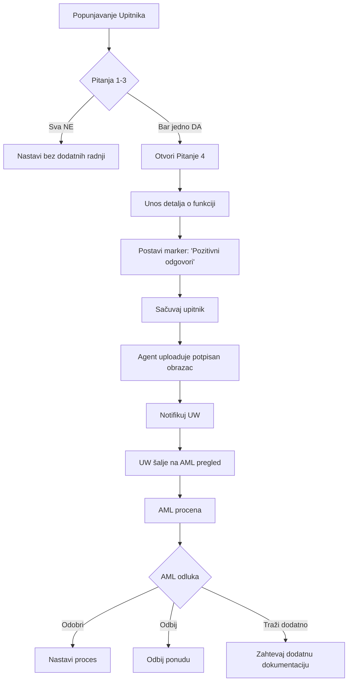

# UPITNIK ZA IDENTIFIKACIJU FUNKCIONERA (Functionary Identification Questionnaire)

## Osnovne Informacije

**Tip Upitnika**: Upitnik za identifikaciju funkcionera (PEP - Politically Exposed Person)  
**QuestionnaireTypeID**: Potrebno mapirati na postojeći ili kreirati novi  
**Svrha**: AML (Anti-Money Laundering) compliance  
**Primena**: Kada je ugovarač fizičko ili pravno lice

## Pravila Prikazivanja

### Kada se Prikazuje

- **Za ugovarača** - uvek
- **Pravna lica** - dodatna polja za stvarnog vlasnika

### Specificnosti za Pravna Lica

Kada je ugovarač **pravno lice**:
1. Prikazuje se pitanje: "Da li postoji više stvarnih vlasnika?"
   - **Odgovor DA**: Otvara se više pod-tabova
   - **Odgovor NE**: Jedan obrazac

2. **Pod-tabovi**:
   - Stvarni vlasnik br. 1
   - Stvarni vlasnik br. 2
   - Stvarni vlasnik br. N

3. **Za svakog stvarnog vlasnika** popunjava se poseban upitnik

4. **Štampa, upload i prenos u DMS** za svaki obrazac posebno

## Struktura Pitanja

### Pitanje 1: Politički Eksponirana Osoba (PEP)

**QuestionID**: TBD  
**QuestionText**: "Da li ste politički eksponirana osoba ili član porodice politički eksponirane osobe ili  s njom povezana pomoćd blisku povezanost?"  
**QuestionOrder**: 1  
**QuestionFormatID**: Boolean (Da/Ne)  
**Required**: Da (obavezno polje)

**Predefinisani Odgovori**:
| PredefinedAnswerID | Answer | Code | PreSelected | SubQuestionID | StatisticalWeight |
|-------------------|---------|------|-------------|---------------|-------------------|
| TBD | Da | YES | Ne | TBD (Pitanje 4) | NULL |
| TBD | Ne | NO | Ne | NULL | NULL |

**Logika Grananja**:
```
**Napomena za UW**:
- Postaviti marker
- Notifikovati AML tim
```

---

### Pitanje 2: Funkcija u Međunarodnoj Organizaciji

**QuestionID**: TBD  
**QuestionText**: "Da li obavljate ili ste obavljali istaknutu javnu funkciju u međunarodnoj organizaciji?"  
**QuestionOrder**: 2  
**QuestionFormatID**: Boolean (Da/Ne)  
**Required**: Da (obavezno polje)

**Predefinisani Odgovori**:
| PredefinedAnswerID | Answer | Code | PreSelected | SubQuestionID | StatisticalWeight |
|-------------------|---------|------|-------------|---------------|-------------------|
| TBD | Da | YES | Ne | TBD (Pitanje 4) | NULL |
| TBD | Ne | NO | Ne | NULL | NULL |

**Logika Grananja**:
```
**Napomena za UW**:
- Postaviti marker
- Notifikovati AML tim
```

---

### Pitanje 3: Funkcija u Državnim Organima/Javnim Preduzećima

**QuestionID**: TBD  
**QuestionText**: "Da li obavljate ili ste obavljali istaknutu javnu funkciju u državnim organima vlasti, organima lokalne samouprave, javnim preduzećima, političkim strankama?"  
**QuestionOrder**: 3  
**QuestionFormatID**: Boolean (Da/Ne)  
**Required**: Da (obavezno polje)

**Predefinisani Odgovori**:
| PredefinedAnswerID | Answer | Code | PreSelected | SubQuestionID | StatisticalWeight |
|-------------------|---------|------|-------------|---------------|-------------------|
| TBD | Da | YES | Ne | TBD (Pitanje 4) | NULL |
| TBD | Ne | NO | Ne | NULL | NULL |

**Logika Grananja**:
```
**Napomena za UW**:
- Postaviti marker
- Notifikovati AML tim
```

---

### Pitanje 4: Detalji o Funkciji (Podpitanje)

**QuestionID**: TBD (SubQuestion)  
**QuestionText**: "Navedite detalje o funkciji"  
**QuestionOrder**: 4  
**QuestionFormatID**: String (free text)  
**Required**: Da (ako je bilo koje od pitanja 1-3 = "Da")  
**ParentQuestionID**: Pitanje 1, 2 ili 3

**Tip podatka**: String (slobodan unos)

**Logika**:
```
IF (Pitanje1 = "Da" OR Pitanje2 = "Da" OR Pitanje3 = "Da") THEN
    - Prikaži Pitanje 4 za unos
    - Required = True
    - Prikaži poruku AML-u
END IF
```

**Poruka kada se otvori Pitanje 4**:
> "Original popunjenog i potpisanog Upitnika za funkcionera poslati putem pošte na saglasnost ovlašćenom licu za sprečavanje pranja novca i finansiranje terorizma / SPNFT"

---

### Pitanje 5: Izvori Sredstava

**QuestionID**: TBD  
**QuestionText**: "Koje su glavni izvori Vaših prihoda/sredstava?"  
**QuestionOrder**: 5  
**QuestionFormatID**: Multiple Choice (Check box - više opcija)  
**Required**: Da (obavezno polje)

**Predefinisani Odgovori**:
| PredefinedAnswerID | Answer | Code | PreSelected | SubQuestionID | StatisticalWeight |
|-------------------|---------|------|-------------|---------------|-------------------|
| TBD | Zarada | SALARY | Ne | NULL | NULL |
| TBD | Penzija | PENSION | Ne | NULL | NULL |
| TBD | Poslovna aktivnost | BUSINESS | Ne | NULL | NULL |
| TBD | Štednja | SAVINGS | Ne | NULL | NULL |
| TBD | Drugi prihodi | OTHER | Ne | TBD (Unos teksta) | NULL |

**Logika**:
```
- Omogućiti izbor više opcija (checkboxes)
- IF "Drugi prihodi" selected THEN
    - Otvori editabilno polje za slobodan unos teksta
END IF
```

---

## Specificna Polja za Pravna Lica

### Stvarni Vlasnik (Dodatna Polja)

Kada je ugovarač **pravno lice**, dodaju se sledeća polja:

| Naziv Polja | Tip | Obavezno | Napomena |
|-------------|-----|----------|----------|
| Stvarni vlasnik (Ime i prezime) | String | Da | - |
| Mesto rođenja stvarnog vlasnika | String | Da | - |
| Udeo  u vlasništvu (%) | Decimal | Da | Proce ntualni udeo |

**Logika za više vlasnika**:
```
IF "Da li postoji više stvarnih vlasnika?" = "Da" THEN
    - Kreira nove pod-tabove
    - Tab: "Stvarni vlasnik br. 1"
    - Tab: "Stvarni vlasnik br. 2"
    - ...
    - Svaki tab ima:
        * Kompletan upitnik (pitanja 1-5)
        * Dodatna polja za stvarnog vlasnika
        * Posebnu štampu
        * Poseban upload
        * Poseban prenos u DMS
END IF
```

## Validacione Pravila

### Obaveznost Popunjavanja

```sql
-- Sva polja su obavezna za unos
-- Nemoguće preći na sledeći Tab bez popunjavanja svih polja

IF Any_Question_Not Answered THEN
    SHOW "Niste odgovorili na pitanje broj X"
    BLOCK Navigation to Next Tab
END IF
```

### Posebna Notifikacija za AML

```
**Napomena za UW**:
- Postaviti marker: "Pozitivni odgovori na Upitniku za funkcionera"
- Kreirati notifikaciju za UW i AML
- Zahtevati fizički potpis
```

## Međuzavisnosti

### Sa AML Procesom



### Sa Tab AML

**Marker** "Pozitivni odgovori na Upitniku za funkcionera" se prikazuje na:
- **Tab Underwriting** → UW vidi notifikaciju
- **Tab AML** → AML vidi notifikaciju i pristupa upitniku

**Notifikacija**:
> "Postoje pozitivni odgovori na Upitniku za funkcionera"

## Dokumentacija

### Štampa

- Generiše se PDF upitnika
- Za pravna lica sa više vlasnika: jedan PDF po vlasniku

### Upload

- Agent/Administracija uploaduje **potpisan** obrazac
- Za pravna lica: poseban upload za svakog vlasnika

### Prenos u DMS

- Svi popunjeni i potpisani upitnici prenose se u DMS
- Odvojen dokument za svakog stvarnog vlasnika (pravna lica)

## Integracija sa Bazom

### Mapiranje na QuestionnaireTypes

```sql
INSERT INTO QuestionnaireTypes (QuestionnaireTypeID, Name, Description, Code)
VALUES 
(TBD, 'Upitnik za funkcionera', 'AML upitnik za identifikaciju politički eksponiranih osoba', 'FUNCTIONARY_QUEST');
```

### Mapiranje Pitanja

```sql
-- Pitanje 1
INSERT INTO Questions (QuestionID, QuestionText, QuestionOrder, QuestionFormatID, SpecificQuestionTypeID)
VALUES 
(TBD, 'Da li ste politički eksponirana osoba...', 1, (SELECT QuestionFormatID FROM QuestionFormats WHERE Name = 'Boolean'), TBD);

-- Predefinisani odgovori
INSERT INTO PredefinedAnswers (PredefinedAnswerID, QuestionID, PreSelected, Answer, Code)
VALUES 
(TBD, TBD, 0, 'Da', 'YES'),
(TBD, TBD, 0, 'Ne', 'NO');

-- Sub-question (Pitanje 4)
INSERT INTO PredefinedAnswerSubQuestions (PredefinedAnswerSubQuestionID, PredefinedAnswerID, SubQuestionID)
VALUES 
(TBD, (SELECT PredefinedAnswerID WHERE Code = 'YES' AND QuestionID = TBD), TBD);

-- Pitanje 5 - Multiple choice
INSERT INTO Questions (QuestionID, QuestionText, QuestionOrder, QuestionFormatID, SpecificQuestionTypeID)
VALUES 
(TBD, 'Koje su glavni izvori Vaših prihoda/sredstava?', 5, (SELECT QuestionFormatID FROM QuestionFormats WHERE Name = 'Multiple Choice'), TBD);
```

## Gap Analiza - Nedostajuće Komponente

### U Modelu Baze (Questionnaire Domain)

1. ✅ **QuestionnaireTypes** - Postoji, dodati tip "FUNCTIONARY_QUEST"
2. ✅ **Questions** - Postoji
3. ✅ **PredefinedAnswers** - Postoji
4. ✅ **PredefinedAnswerSubQuestions** - Postoji (za grananje)
5. ⚠️ **BeneficialOwners** - Potrebno dodati tabelu za skladištenje podataka o stvarnim vlasnicima (Data Capture)
6. ⚠️ **QuestionnaireInstances** - Potrebno omogućiti više instanci istog upitnika (za više vlasnika)

*Napomena: `AMLMarkers` (Interpretacija) pripada **Compliance/UW Modulu**, dok se sirovi odgovori čuvaju ovde.*

### Predložene Nove Tabele

#### 1. BeneficialOwners

```sql
CREATE TABLE BeneficialOwners (
    BeneficialOwnerID INT PRIMARY KEY IDENTITY(1,1),
    ConcernID INT NOT NULL, -- ili DocumentID, u zavisnosti od strukture
    OwnerName NVARCHAR(500) NOT NULL,
    BirthPlace NVARCHAR(200) NOT NULL,
    OwnershipPercentage DECIMAL(5,2) NOT NULL,
    QuestionnaireInstanceID INT NULL, -- Povezanost sa instancom upitnika
    CreatedDate DATETIME NOT NULL DEFAULT GETDATE(),
    CONSTRAINT FK_BeneficialOwners_Concerns 
        FOREIGN KEY (ConcernID) REFERENCES Concerns(ConcernID)
);
```

#### 2. AMLMarkers

```sql
CREATE TABLE AMLMarkers (
    AMLMarkerID INT PRIMARY KEY IDENTITY(1,1),
    ConcernID INT NOT NULL,
    MarkerType NVARCHAR(100) NOT NULL, 
    -- 'PEP_POSITIVE', 'HIGH_RISK_PREMIUM', 'RISK_ASSESSMENT_HIGH', etc.
    MarkerSource NVARCHAR(100) NOT NULL, 
    -- 'FUNCTIONARY_QUEST', 'PREMIUM_CHECK', 'RISK_ ASSESSMENT', etc.
    MarkerDate DATETIME NOT NULL DEFAULT GETDATE(),
    ResolvedDate DATETIME NULL,
    IsResolved BIT NOT NULL DEFAULT 0,
    Notes NVARCHAR(MAX) NULL,
    CONSTRAINT FK_AMLMarkers_Concerns 
        FOREIGN KEY (ConcernID) REFERENCES Concerns(ConcernID)
);
```

#### 3. QuestionnaireInstances

```sql
CREATE TABLE QuestionnaireInstances (
    QuestionnaireInstanceID INT PRIMARY KEY IDENTITY(1,1),
    ConcernID INT NOT NULL,
    QuestionnaireTypeID SMALLINT NOT NULL,
    InstanceNumber INT NOT NULL DEFAULT 1, -- 1, 2, 3... za više instanci
    BeneficialOwnerID INT NULL, -- Za funkcionera upitnik
    CompletedDate DATETIME NULL,
    UploadedDocumentPath NVARCHAR(500) NULL,
    DMSDocumentID NVARCHAR(100) NULL,
    CreatedDate DATETIME NOT NULL DEFAULT GETDATE(),
    CONSTRAINT FK_QuestionnaireInstances_Concerns 
        FOREIGN KEY (ConcernID) REFERENCES Concerns(ConcernID),
    CONSTRAINT FK_QuestionnaireInstances_QuestionnaireTypes 
        FOREIGN KEY (QuestionnaireTypeID) REFERENCES QuestionnaireTypes(QuestionnaireTypeID),
    CONSTRAINT FK_QuestionnaireInstances_BeneficialOwners 
        FOREIGN KEY (BeneficialOwnerID) REFERENCES BeneficialOwners(BeneficialOwnerID),
    CONSTRAINT UQ_QuestionnaireInstances_Concern_Type_Instance 
        UNIQUE (ConcernID, QuestionnaireTypeID, InstanceNumber)
);
```

## Korisničke Radnje

### Korisnik aplikacije

| Radnja | Sistem - WIWA Life | Rezultat |
|--------|-------------------|----------|
| Popunjava podatke vezane za ugovarača | Sva polja su obavezna za unos uz čekiranje opcija DA ili NE | Polja validirana |
| Preskoči unos nekog polja | Prikaz poruke: "Niste odgovorili na pitanje broj x" | Onemogućava prelaz na sledeći Tab |
| Odgovori na neko pitanje sa DA | Otvara pitanje broj 4 za slobodan unos | Podpitanje prikazano |
| Odgovara na pitanje broj 1, 2 ili 3 sa Da | Otvara pitanje broj 4 za slobodan unos + Poruka: "Original popunjenog i potpisanog Upitnika za funkcionera poslati putem pošte na saglasnost ovlašćenom licu za sprečavanje pranja novca i finansiranje terorizma / SPNFT" | Postavljen marker za AML |
| Kao ugovarača je izabrao pravno lice | Prikazuje pitanje: "Da li postoji više stvarnih vlasnika?" sa DA/NE. Ako DA: Otvara nove pod-tabove za svakog vlasnika | Više instanci upitnika |
| Popunjava pitanje broj 5 | Check box za svako od podpitanja, omogućavačekiranje više opcija. Ako je "Drugi prihodi" (5.5): otvara se editabilno polje za slobodan unos | Odgovori sačuvani |
| Bira opciju Sačuvaj ili Izmeni | Čuva podatke ili otključava polja za dodatnu izmenu | Podaci sačuvani |

## Statistički Uticaj na Rezultat

Upitnik za funkcionera **NE utiče direktno** na:
- Premiju
- Osiguranu sumu
- Korekcije

**Utiče na**:
1. **AML Proces** - Pozitivni odgovori šalju ponudu na AML pregled
2. **Status ponude** - Može dovesti do odbijanja ako AML ne odobri
3. **Dokumentaciju** - Zahteva dodatnu dokumentaciju i fizički potpisan obrazac

---

## Referencirana Dokumentacija

Kompletni podaci se nalaze u sledećim fajlovima (dostupni u `docs/specification/Upitnici i obrasci`):
1. **Vizuelni Izgled**: `upitnik_za _identifikaciju_funkcionera.png`
2. **Pravila**: `Pregled upitnika za osiguranje.xlsx` (AML deo)

---

*Status: Finalized - Usklađeno sa AML procedurama i vizuelnim predloškom*
