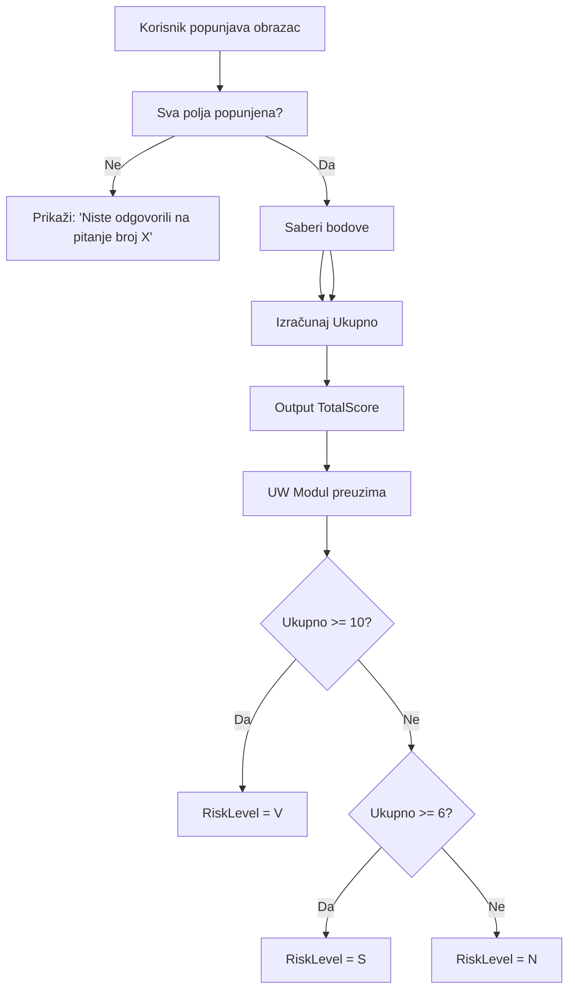

# OBRAZAC ZA PROCENU RIZIKA (Risk Assessment Form)

## Osnovne Informacije

**Tip Upitnika**: Obrazac za procenu AML rizika  
**QuestionnaireTypeID**: Potrebno mapirati na postojeći ili kreirati novi  
**Svrha**: Određivanje nivoa AML rizika klijenta  
**Primena**: Za ugovarača - uvek

## Sistem Bodovanja

### Nivoi Rizika

| Nivo Rizika | Oznaka | Bodovi | Akcija |
|-------------|---------|--------|---------|
| Nizak rizik | N | 0-5 | Nastavi bez dodatnih provera |
| Srednji rizik | S | 6-9 | Notifikuj UW i AML |
| Visok rizik | V | 10 i više | Obavezna AML procena |

### Automatska Kalkulacija (Upitnik Domain)

```
Ukupno Bodova = SUM(Bodovi za svako pitanje)
Output = { TotalScore: 12 }
*Napomena: Određivanje RiskLevelCode ('V') radi UW modul.*
```

### Interpretacija (UW Domain)

- **Nizak (N)**: 0-5 bodova → Bez akcije
- **Srednji (S)**: 6-9 bodova → `UW_REVIEW_REQUIRED`
- **Visok (V)**: 10+ bodova → `AML_REVIEW_REQUIRED`

## Struktura Pitanja

**Napomena**: Potpuna struktura pitanja NIJE detaljno specificirana u dokumentu. Navedeni su samo principi i nivoi rizika.

Prema standardnoj AML praksi, Obrazac za procenu rizika obično sadrži pitanja o:

### 1. Geografski Rizik

**Pitanja**:
- Zemlja državljanstva
- Zemlja prebivališta
- Zemlja poslovanja (pravna lica)

**Bodovanje**: Zemlje sa višim AML rizikom = više bodova

### 2. Vrsta Klijenta

**Pitanja**:
- Fizičko lice
- Pravno lice
- NVO / Fondacije
- Trust / Offshore kompanija

**Bodovanje**: Kompleksnije strukture = više bodova

### 3. Proizvod / Usluga

**Pitanja**:
- Tip police
- Visina premije
- Jednokratna vs. regularna premija
- Trajanje police

**Bodovanje**: Viša premija / jednokratna = više bodova

### 4. Način Isplate

**Pitanja**:
- Gotovina
- Bankovni transfer
- Ček
- Kreditna kartica

**Bodovanje**: Gotovina = više bodova

### 5. Distribucioni Kanal

**Pitanja**:
- Direktna prodaja
- Agent
- Broker
- Online

**Bodovanje**: Zavisi od kontrole kanala

## Validacione Pravila

### Obaveznost Popunjavanja

```sql
-- Sva polja su obavezna za unos
IF Any_Question_Not_Answered THEN
    SHOW "Niste odgovorili na pitanje broj X"
    BLOCK Navigation to Next Tab
END IF
```

### Automatsko Izračunavanje

Sistem automatski:
1. **Sabira bodove** za svako odgovoreno pitanje
2. **Upisuje u polje "Ukupno"**
3. **Određuje nivo rizika** (N, S, V)
4. **Prikazuje poruku** ako je nivo S ili V

## Logika i Međuzavisnosti



### Poruke Prema Nivou Rizika

#### Srednji Rizik (S)

**Marker**: "Na osnovu obrasca za procenu rizika klijent spada u Srednji rizik"

**Akcije**:
- Notifikuj UW
- UW šalje ponudu AML-u
- AML procena obavezna

#### Visok Rizik (V)

**Marker**: "Na osnovu obrasca za procenu rizika klijent spada u Visok rizik"

**Akcije**:
- Notifikuj UW
- UW šalje ponudu AML-u
- AML procena obavezna + pojačane mere

## Korisničke Radnje

| Radnja Korisnika | Sistem - WIWA Life | Rezultat |
|------------------|-------------------|----------|
| Popunjava podatke vezane za ugovarača | Sva polja su obavezna za unos uz čekiranje opcija DA ili NE | Validacija obaveznih polja |
| Preskoči unos nekog polja | Prikaz poruke: "Niste odgovorili na pitanje broj x" | Onemogućava prelaz na sledeći Tab |
| Popuni sva polja | Sabira i upisuje broj bodova u polje "Ukupno" | Automatska kalkulacija |
| Ukupno bodova → Srednji ili Visok rizik | Prikazuje se poruka UW i AML (objašnjeno kod istoimenih tabova) | Notifikacije postavljene |

## Veza sa AML Procesom

### Integracija sa Tab AML

**Prikaz na Tab AML**:
- "Na osnovu obrasca za procenu rizika klijent spada u Srednji rizik"
- "Na osnovu obrasca za procenu rizika klijent spada u Visok rizik"

**Prikaz na Tab Underwriting**:
- Iste notifikacije
- UW klikom na "Pošalji AML-u" prosleđuje ponudu

### Veza sa Premijom

**Obrazac za procenu rizika** se koristi **ZAJEDNO** sa:
- **Visinom premije** (regularna ili jednokratna)
- **Upitnikom za funkcionera**

Za određivanje **konačnog AML rizika**.

## Integracija sa Bazom

### Mapiranje na QuestionnaireTypes

```sql
INSERT INTO QuestionnaireTypes (QuestionnaireTypeID, Name, Description, Code)
VALUES 
(TBD, 'Obrazac za procenu rizika', 'AML obrazac za procenu nivoa rizika klijenta', 'RISK_ASSESSMENT');
```

### Mapiranje Pitanja (Primer)

```sql
-- Primer: Pitanje o geografskom riziku
INSERT INTO Questions (QuestionID, QuestionText, QuestionOrder, QuestionFormatID, SpecificQuestionTypeID)
VALUES 
(TBD, 'Zemlja državljanstva', 1, (SELECT QuestionFormatID FROM QuestionFormats WHERE Name = 'Dropdown'), TBD);

-- Predefinisani odgovori sa bodovima
INSERT INTO PredefinedAnswers (PredefinedAnswerID, QuestionID, Answer, Code, StatisticalWeight)
VALUES 
(TBD, TBD, 'Srbija', 'RS', 0), -- Nizak rizik
(TBD, TBD, 'EU zemlje', 'EU', 1), -- Nizak rizik
(TBD, TBD, 'Rusija', 'RU', 5), -- Srednji rizik
(TBD, TBD, 'Zemlje pod sankcijama', 'SANCTIONED', 10); -- Visok rizik
```

### Tabela za Skladištenje Rezultata

```sql
CREATE TABLE RiskAssessmentResults (
    RiskAssessmentResultID INT PRIMARY KEY IDENTITY(1,1),
    ConcernID INT NOT NULL,
    QuestionnaireInstanceID INT NULL,
    TotalScore INT NOT NULL,
    RiskLevel CHAR(1) NOT NULL, -- 'N', 'S', 'V'
    AssessmentDate DATETIME NOT NULL DEFAULT GETDATE(),
    ReviewedByAML BIT NOT NULL DEFAULT 0,
    AMLReviewDate DATETIME NULL,
    AMLDecision NVARCHAR(50) NULL, -- 'APPROVED', 'REJECTED', 'ADDITIONAL_DOCS'
    Notes NVARCHAR(MAX) NULL,
    CONSTRAINT FK_RiskAssessmentResults_Concerns 
        FOREIGN KEY (ConcernID) REFERENCES Concerns(ConcernID),
    CONSTRAINT CHK_RiskAssessmentResults_RiskLevel 
        CHECK (RiskLevel IN ('N', 'S', 'V'))
);
```

## Gap Analiza - Nedostajuće Komponente

### U Modelu Baze

1. ✅ **QuestionnaireTypes** - Postoji, dodati tip "RISK_ASSESSMENT"
2. ✅ **Questions** - Postoji
3. ✅ **PredefinedAnswers** - Postoji
4. ✅ **StatisticalWeight** - Postoji u PredefinedAnswers (za bodovanje)
5. ⚠️ **RiskAssessmentResults** - Potrebno dodati tabelu za skladištenje rezultata
6. ⚠️ **RiskLevelRules** - Potrebno dodati tabelu za pravila određivanja nivoa rizika
7. ⚠️ **AMLMarkers** - Već predloženo u dokumentu 04_UPITNIK_ZA_FUNKCIONERA.md

### Predložene Nove Tabele

#### 1. RiskLevelRules

```sql
CREATE TABLE RiskLevelRules (
    RiskLevelRuleID INT PRIMARY KEY IDENTITY(1,1),
    RiskLevel CHAR(1) NOT NULL, -- 'N', 'S', 'V'
    MinScore INT NOT NULL,
    MaxScore INT NULL,
    Description NVARCHAR(500) NULL,
    RequiresAMLReview BIT NOT NULL DEFAULT 0,
    RequiresUWNotification BIT NOT NULL DEFAULT 0,
    IsActive BIT NOT NULL DEFAULT 1,
    CONSTRAINT CHK_RiskLevelRules_RiskLevel 
        CHECK (RiskLevel IN ('N', 'S', 'V'))
);
```

**Primer podataka**:
```sql
INSERT INTO RiskLevelRules (RiskLevel, MinScore, MaxScore, Description, RequiresAMLReview, RequiresUWNotification)
VALUES
('N', 0, 5, 'Nizak rizik', 0, 0),
('S', 6, 9, 'Srednji rizik', 1, 1),
('V', 10, NULL, 'Visok rizik', 1, 1);
```

#### 2. QuestionScoring (opciono - za kompleksnije bodovanje)

```sql
CREATE TABLE QuestionScoring (
    QuestionScoringID INT PRIMARY KEY IDENTITY(1,1),
    QuestionID INT NOT NULL,
    ScoringMethodID INT NOT NULL,
    BaseScore INT NULL,
    IsActive BIT NOT NULL DEFAULT 1,
    CONSTRAINT FK_QuestionScoring_Questions 
        FOREIGN KEY (QuestionID) REFERENCES Questions(QuestionID)
);
```

## Kombinirani AML Rizik

### Faktori koji Utiču na Konačan AML Rizik

1. **Obrazac za procenu rizika** (Nivo: N, S, V)
2. **Visina premije**:
   - Regularna: 2.500-4.999 EUR → Srednji, ≥5.000 EUR → Visok
   - Jednokratna: 15.000-99.999 EUR → Srednji, ≥100.000 EUR → Visok
3. **Upitnik za funkcionera**: Pozitivni odgovori → Dodatni rizik
4. **Broj ugovora**: Prethodni ugovori označeni kao visok rizik

### Logika Kombinovanja

```
Konačan_AML_Rizik = MAX(
    Obrazac_Rizik,
    Premija_Rizik,
    Funkioner_Rizik,
    Istorija_Rizik
)

IF Konačan_AML_Rizik >= "Srednji" THEN
    - Šalji na AML pregled
    - Obavezna AML procena
END IF
```

## Statistički Uticaj na Rezultat

Obrazac za procenu rizika **NE utiče direktno** na:
- Premiju
- Osiguranu sumu
- Korekcije

**Utiče na**:
1. **AML Proces** - Određuje da li ide na AML pregled
2. **Status ponude** - Može dovesti do odbijanja ako AML ne odobri
3. **Dokumentaciju** - Može zahtevati dodatnu dokumentaciju
4. **Vreme obrade** - Visok rizik = duža obrada

## Dokumentacija

### Čuvanje Obrasca

- PDF obrazac sa popunjenim podacima
- Ukupan skor
- Nivo rizika
- Datum procene

### Upload u DMS

- Popunjen obrazac se prenosi u DMS
- Deo kompletne AML dokumentacije

---

## Referencirana Dokumentacija

Kompletni podaci se nalaze u sledećim fajlovima (dostupni u `docs/specification/Upitnici i obrasci`):
1. **Vizuelni Izgled**: `obrazac_za_procenu_tizika.png`
2. **Pravila Bodovanja**: Standardna AML praksa + `Pregled upitnika za osiguranje.xlsx`

---

*Status: Finalized - Logika bodovanja definisana prema vizuelnom predlošku*
